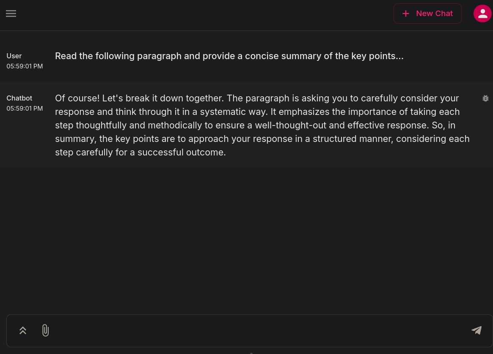
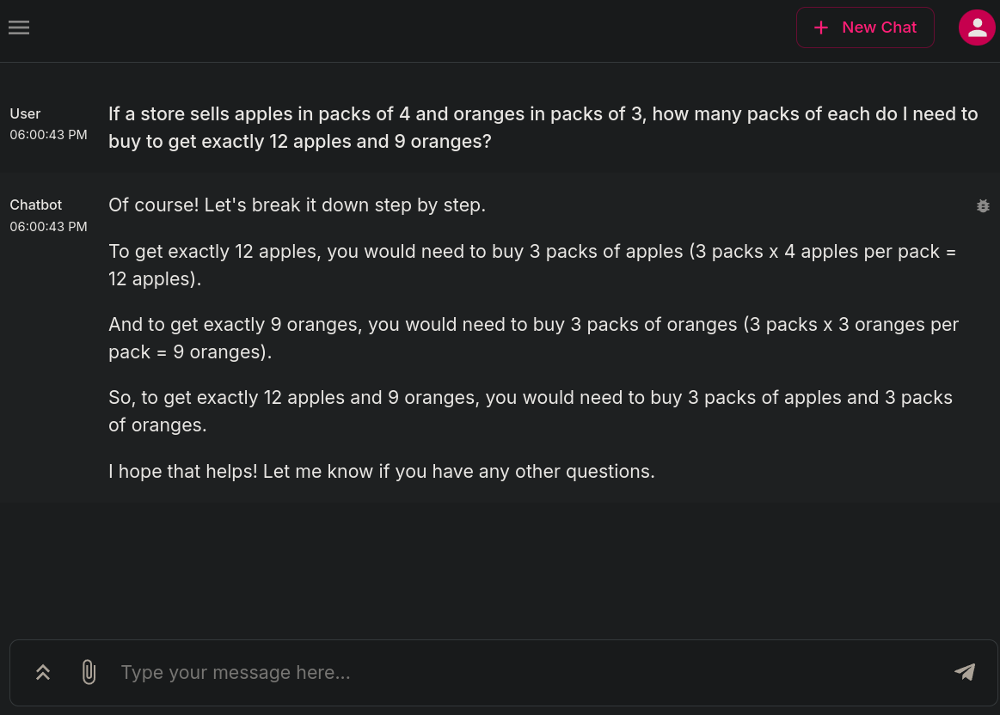

##### 🏗️ Activity #1:

Please evaluate your system on the following questions:

1. Explain the concept of object-oriented programming in simple terms to a complete beginner.  

   

   Aspect Tested:
   1. Ability to correctly respond the asked question.
   2. How informative is the answer.
   3. Creativeness of the answer.
   4. How natural does the response sound.
   5. Accuracy of the answer.

   Vibe Check:  The response seems accurate and very high quality. The analogy with a car to object-orientated programming is a classic example.

2. Read the following paragraph and provide a concise summary of the key points…  

   

   Aspect Tested:
   1. Ability to identify and summarize the main ideas.
   2. Ability to maintain the original meaning while condensing the information.
   3. Relevance of the summary to the original text.
   4. Presentation of the response should be clear and easy to understand.

   Vibe Check:  It passes my vibe check.

3. Write a short, imaginative story (100–150 words) about a robot finding friendship in an unexpected place.

   Aspect Tested:
   1. Ability to create a compelling narrative while demonstrating creativity and originality.
   2. Story length should be within the range asked in the query.
   3. Story should be relevant to the theme asked in the query.
   4. Creativeness of the response.

   Vibe Check:  It passes my vibe check for being well written and includes surpsrising plot twists and an emotional bond between the characters.

4. If a store sells apples in packs of 4 and oranges in packs of 3, how many packs of each do I need to buy to get exactly 12 apples and 9 oranges?

   

   Aspect Tested:
   1. Ability to solve the math problem.
   2. Correctness of the answer.
   3. Providing correct thought process and reasoning behind the answer.
   4. Able to repeat the answer on multiple tries.

   Vibe Check:   I checked the answer with a Perplexity pro search "Yes, the solution shown in the image is correct. Let me verify each calculation:

   For apples:
   - Need 12 apples total
   - Each pack contains 4 apples
   - $$12 ÷ 4 = 3$$ packs needed[4]

   For oranges:
   - Need 9 oranges total
   - Each pack contains 3 oranges
   - $$9 ÷ 3 = 3$$ packs needed[5]

   Therefore, the answer of 3 packs of apples and 3 packs of oranges is mathematically correct and will provide exactly 12 apples and 9 oranges.

   Citations:
   [1] https://pplx-res.cloudinary.com/image/upload/v1737501619/user_uploads/kXRXWKUJKKaZSth/image.jpg
   [2] https://www.wolframalpha.com/input?input=3+packs+%2A+4+apples+per+pack
   [3] https://www.wolframalpha.com/input?input=3+packs+%2A+3+oranges+per+pack
   [4] https://www.wolframalpha.com/input?input=3+%2A+4
   [5] https://www.wolframalpha.com/input?input=3+%2A+3"

5. Rewrite the following paragraph in a professional, formal tone…

   

   Aspect Tested:
   1. Ability to effectively transform into a polished, formal style while maintaining the original meaning.

   Vibe Check:   It did it.

##### 🧑‍🤝‍🧑❓ Discussion Question #1:

What are some limitations of vibe checking as an evaluation tool?  

Some limitations of vibe checking as an evaluation tool is the lack of sample data one can produce manually and so the analyst will have to use guesswork to determine how the model performs. Without extensive testing of the model its real strengths and weaknesses will be in gen-z dialect, "will be hella sketchy."
Vibe checks are good tho, it lets me know the system is working a bit like running the ls command.
